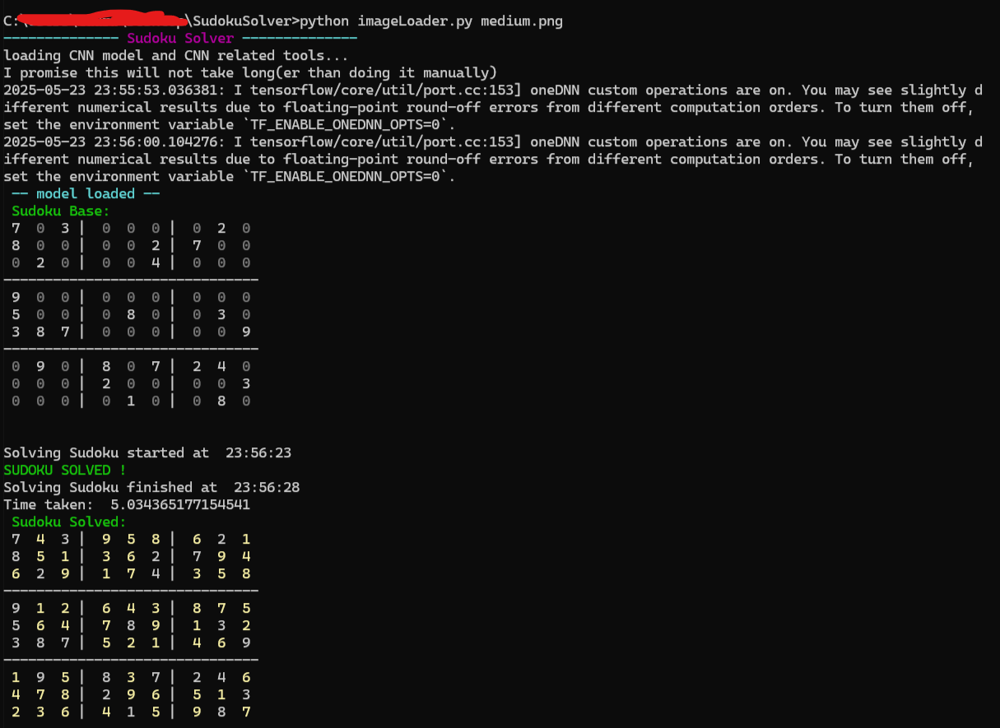
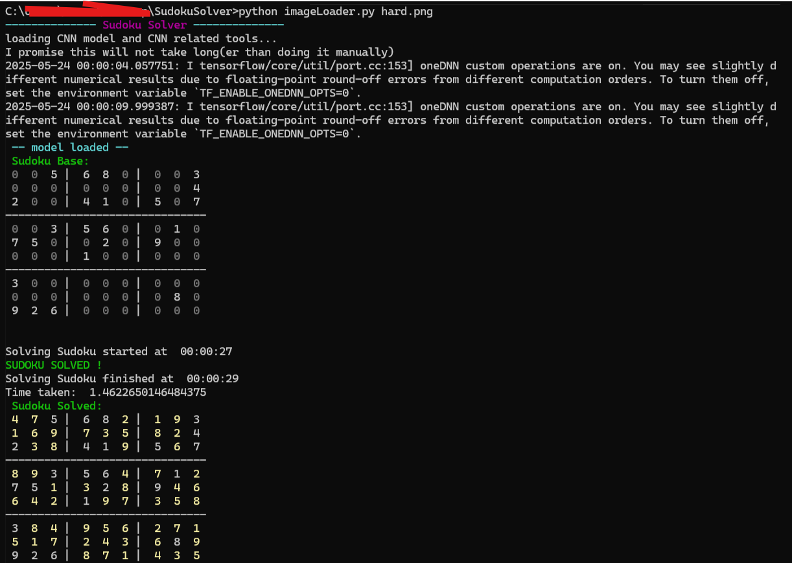
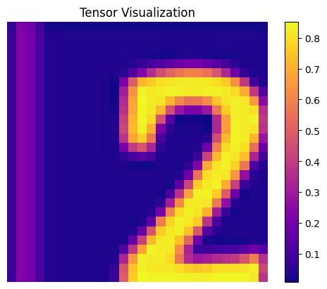
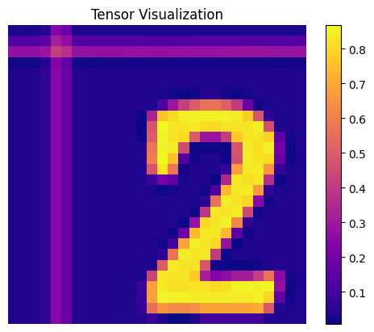
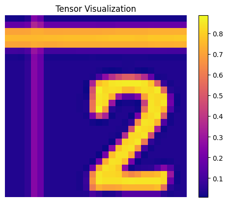
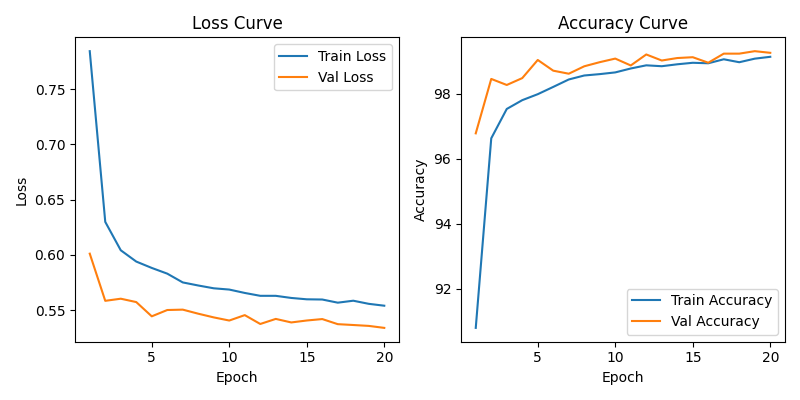

# SudokuSolver
[Welcome to the this pleasure dome](https://www.youtube.com/watch?v=XcSLxE_a-H8&t=1s) of ugly code, but working algorithms.

This algorithm was made in light of how I solve sudokus. Sudokus I make to waste my time, rather than studying for the exams.
Anyway here is a quick overview:

## How do I get my sudoku in python?
I made it so it's all in NumPy. Guess you'll have to copy it by hand in a vector array...
NOPE

Just plug in a screenshot of your puzzle. A CNN trained on numbers will do the hard work for you. It might take some time to load in at the start. But it will be faster than making doing it manually. The way it works is simple (and so if it doesn't work for you... [see good example images](#good-sudoku-images)):

- Makes the image square
- Cuts in $n^2$ beautiful image blocks (default $n=9$)
- Puts it through the CNN

The CNN itself is a ResNet18 pretrained on the Imagenet 1k dataset, then fully unfrozen, continued training on a tweaked MNIST dataset (tweaked such that it distinguishes empty boxes). Thus, if it doesn't work, try to make a cleaner screenshot of your puzzle. Have a look at some of the screenshots in this repo for example.

## The Steps of Doom *aka* The Algorithm

### 1) Exhausting unicity
This part is done repeatedly until it is *exhausted*. This is done multiple times after 
>! the backtracking (spoilers!!!)

. And this is what fills in the boxes. It works on the collection of possibilities per square. This is easily obtainable as the set difference of $[1,...,n]$ with the respective row, column and box of a cell. It checks for 2 things and 2 things only
- If there is a cell with a single possibility, it must be that one
- If there is a number that is only possible in a single cell, it must be that one. Note the difference with the other statement. A cell can have two possibilities with one only being available at that cell. 


There is an extra method added to narrow down possibilities. It is based on how I solved sudokus. When in a box, when there is a line of cells, that all have the same number in their options. And this number is exclusively in that line of cells, one can rule out the entire column or row for that number since it will be in the line anyway. However, this adds more time to getting the possibilities, and so to solving. Thus, not advicing to use it. It is available as a boolean variable in the possibilities function.
### 3) Back Tracking
This works recursively in the following way:
- search for some boxes with lesser possibilities (default $k=2$). Lesser, such one can easily guess all options.
- consistently check for [contradictions](#what-is-a-contradiction) 
- Try them depth first, i.e. when no contradiction is (immediately) found, just continue and exhaust it. 
- No contradiction and not solved, make another guess
- Contradiction found, return $False$ signal to let the rest know to drop that branch
- Rinse and repeat


### What is a Contradiction
A contradiction would make the sudoku not solvable. These are only two conditions.
- If there is an empty cell with no possibilities
- If there is a number with no possible cell

### Some Images
[](readmeImages/result1.png)
[](readmeImages/result2.png)

### Good Sudoku Images
Try to take the screenshot as square as possible to prevent distortion. Do not include fancy borders etc, see example

This is a bad example. It includes a decorative border.

[](readmeImages/exampleSudokus/test.png)

This is a better shot of the sudoku.

[](readmeImages/exampleSudokus/testT.png)

When Numbers are close to the border of the cut images some problems can occur. The CNN crop images to get centered results with no borders. This is not always good, since cuts may not result in centered numbers (see example). A specialized tranform, will try to trim borders from images. One can use variable ```--center_crop 35``` to stop or increase cropping. The default crops from size 35x35 to 28x28. Setting this variable will stop cropping. This specialized transform checks for low activity rows and columns. When a certain vector has less than ```--low_activity_percent``` % (default 10) with value over ```--low_activity_threshold``` (default 0.5), it is removed.


This is a bad example. Cropping is done by default, removing some parts of the number 2 with as a result the CNN thinking it's a 7.

[](readmeImages/default_crop.png)

No crop is better, ```--center_crop 28```. This way the CNN reads it as 2. 

[](readmeImages/no_crop.png)

No low activity trimming with specialized tranform, ```--low_activity_threshold 0```. The border is too prominent in this image. It will read as 7.

[](readmeImages/no_trim.png)

With trimming (default), ```---low_activity_threshold 0.5```. This way the CNN reads it as 2. 

[](readmeImages/trim.png)

If the results are still bad try to make the image more square. 

### CNN
Training progress:
[](cnn/model_1_learning_curves.png)
```"test_acc": 0.9944594594594595```

### Disclaimer
I know it's messy. The repo is just everything thrown together. Same for the code. I don't care, it's just a side show.
